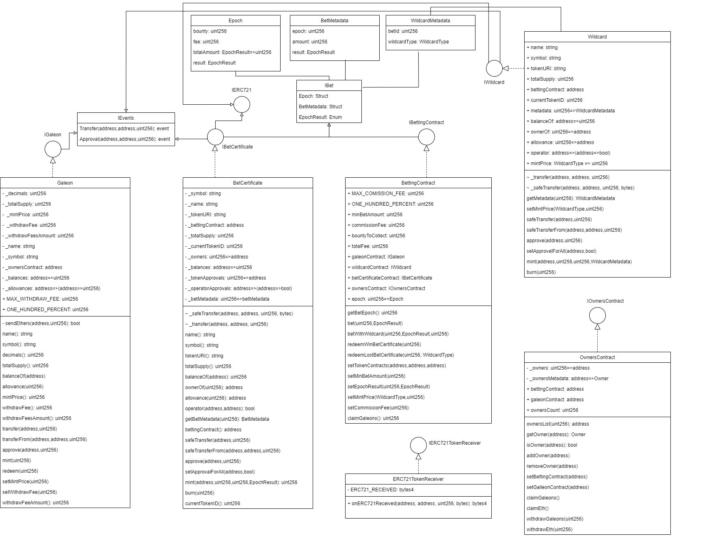
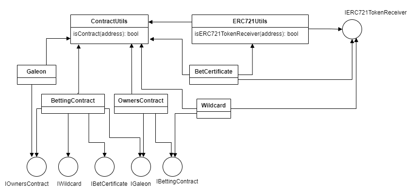
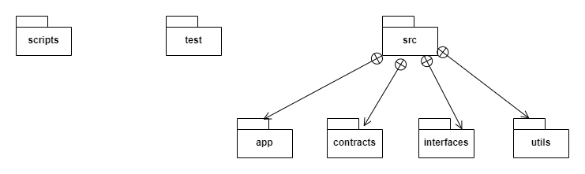

## Descripción del Proyecto

El proyecto consiste en diseñar y desarrollar una plataforma de apuestas basada en predicciones sobre el precio del Ether (ETH) utilizando tecnología Blockchain. El sistema integra varios contratos inteligentes y una aplicación descentralizada (DApp) para ofrecer una experiencia de usuario fluida y segura. 

Se proporcionará una plataforma segura y atractiva para que los usuarios participen en apuestas sobre el precio del ETH, con un sistema de tokens que incentive la participación continua mediante recompensas y comodines.

**Tokens ERC-20 (Galeones)**

Los usuarios compran Galeones, que son tokens fungibles utilizados como moneda en la plataforma.
Los Galeones pueden ser adquiridos con ETH y también redimidos a ETH.

**Tokens ERC-721 (Certificados de Apuestas y Comodines)**

Los usuarios reciben certificados de apuestas en forma de tokens no fungibles (NFTs) ERC-721 al participar en apuestas.
Los comodines, también NFTs, son otorgados a usuarios que pierden apuestas, proporcionando beneficios adicionales en futuras apuestas.

**Sistema de Apuestas**

Los usuarios pueden realizar apuestas sobre el precio futuro del ETH, bloqueando sus Galeones en el contrato de apuestas.
Las apuestas solo pueden realizarse para dos días en el futuro.

**Distribución de Recompensas**

Al cerrar las apuestas, los Galeones apostados se distribuyen entre los ganadores proporcionalmente a sus apuestas.
Los ganadores deben quemar sus certificados de apuestas para reclamar sus recompensas y las ganancias.

**Comisiones y Redenciones**

El sistema cobra comisiones sobre las ganancias en forma de Galeones y por retiros en forma de ETH.
Los usuarios pueden redimir sus Galeones para obtener ETH.

**Uso de Comodines**

Los comodines pueden ser utilizados para obtener beneficios adicionales en las apuestas, como un 5% extra al ganar, la capacidad de apostar un día antes del resultado, o realizar dos apuestas en la misma ronda.
Los comodines también pueden ser intercambiados en mercados secundarios.

## Diagramas

### Diagrama de Clases



### Diagrama de Dependencias



### Diagramas de Secuencia

**Escenario 1**: *Un usuario compra galeones*


**Escenario 2**: *Un owner reclama galeones*


**Escenario 3**: *Un usuario hace una apuesta* 


### Diagrama de Descomposición




## Setup

1. Clone el repositorio: 

    - `git clone <https://github.com/NicolasDeLucca/Bethereum_App>`

2. Instale las dependencias del proyecto:

    - `cd <Bethereum_App>`

    - `npm install`

3. Compile la solución:

    - `npx hardhat compile`

4. Ejecute los tests:  

    - todos los tests: `npx hardhat test`

    - tests individuales: `npx hardhat test test/<contractName>.test.js`

## Deploy

En la carpeta `scripts` se añadió el archivo para el deployment de los contratos inteligentes.

Ejecución:

- completar los pasos 1 y 2 del `Setup`

- `npx hardhat run scripts/deploy.js --network <nombre_de_la_red>`

`<nombre_de_la_red>` es la red configurada en la sección networks del archivo `hardhat.config.js`

### Contratos Deployados

Se deployaron los contratos en la plataforma Sepolia Testnet.

Addresses:

- **Galeon**: `0xb56dbd170aaf103fd783af5dd7942412ea30650a`

- **Owners Contract**: `0xb6b8b2197570dcdf23f1586a3f0699b754eaee15`

- **Betting Contract**: `0x692ab9241998162c9d89cdaf7f2a48f311398a10`

- **Bet Certificate**: `0x3754e942309f995fce8bfc2746c0d62626e5e8d5`

- **Wildcard**: `0xe50dd94547f152abf1ff2c3007e57d6e467febce`

## Ejecución de la aplicación

- completar un archivo `.env` siguiendo el ejemplo `.envExample`

- ejecutar el comando `npx hardhat run scripts/deploy.js`

- navegar a `/src/app`

- ejecutar el comando `node nodeServer.js`

El cliente se ejecuta en `localhost:8080`

## Prácticas de Programación

### **Git**

**Uso de la herramienta Github Projects**:

Se identificaron las tareas principales y se adjuntaron en el tablero en la sección de Backlog. 
Se fue actualizando el tablero hasta finalizar todos los ítems.

**Uso de Gitflow**:

Para mantener un buen control de versiones dividimos la implementación de la aplicación en distintas branches:

- `master`: rama principal del repositorio

- `develop`: rama de desarrollo de la aplicación

### **Modularización**

Estructura del proyecto:

```
.
├── src
│   ├── app
│   │   └── 
│   ├── contracts
│   │   └── 
│   ├── interfaces
│   │   └──
│   ├── utils
│       └──
├── assets
├── scripts
├── test
├── .env
├── .gitignore
├── hardhat.config.js
├── package.json
└── README.md
```

El código fuente de la aplicación se encuentra en la carpeta `src`:

- `/app`: contiene la implementación del Frontend de nuestra aplicación descentralizada

- `/contracts`: contiene la implementación de todos los contratos inteligentes para el BackEnd

- `/interfaces`: contiene las interfaces que implementan cada uno de los contratos inteligentes

- `/utils`: contiene librerias que utilizan los contratos inteligentes 

El código de testing se encuentra en la carpeta `test`. Contiene los unit tests de cada contrato inteligente.

### **Abstracción**

**Refactorización**:

La carpeta `/utils` contiene librerías que son utilizadas en varios contratos inteligentes, disminuyendo así el código duplicado. También se aplicaron modificadores en los contratos para reusar el código de validación.

La decisión de implementar métodos privados en los contratos inteligentes es un ejemplo de encapsulación donde los métodos publicos que los utilizan, no conocen su implementación. También se hace hincapié en la Ley de Demeter y en la mantenibilidad del código.

Además, se hace enfasis en el uso de constantes y variables ambientales.

**Técnicas**:

- Mecanismo de ***Herencia de interfaces***:

Se puede notar que las interfaces que implementan los contratos inteligentes, a su vez heredan los métodos de las interfaces `IEvents`, `IERC721` y `IBet`. Estas últimas interfaces desacoplan funcionalidad.

- Patrón de diseño ***Inyección de dependencias***:

Por ejemplo en el contrato inteligente `BettingContract`, podemos notar la función `SetTokenContracts` que nos permite inyectar las dependencias de los demás contratos a partir de sus addresses.

```
function setTokenContracts(address _galeonContract, address _betCertificateContract, address _wildcardContract)     
    validAddress(_galeonContract) 
    validAddress(_betCertificateContract) 
    validAddress(_wildcardContract) external override
{
    require(ContractUtils.isContract(_galeonContract), 'Invalid_galeonContract');
    require(ContractUtils.isContract(_betCertificateContract), 'Invalid_betCertificateContract');
    require(ContractUtils.isContract(_wildcardContract), 'Invalid_wildcardContract');

    galeonContract = IGaleon(_galeonContract);
    betCertificateContract = IBetCertificate(_betCertificateContract);
    wildcardContract = IWildcard(_wildcardContract);
}
```

## Herramientas Utilizadas

- Metamask
- Remix - Ethereum IDE
- Testnet Sepolia
- Solidity
- Hardhat
- Node.js:
    - Web3.js
    - Ethers.js